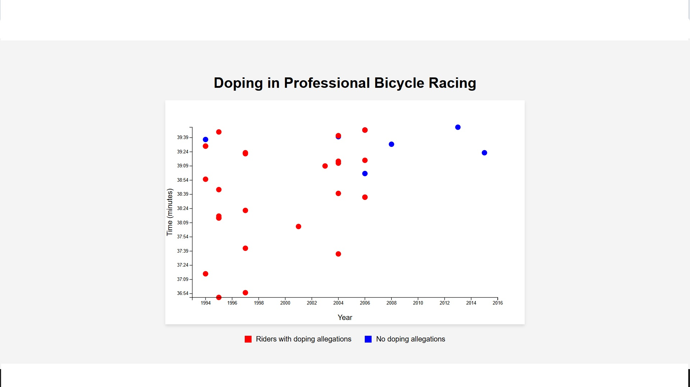

# Scatterplot

This project visualizes cyclist performance data, highlighting doping allegations among professional bicycle racers.

## Live Demo

Check out the live demo [here](https://keen-frangipane-45f8dc.netlify.app/).

## Screenshot



## Installation

1. Clone the repository:
    ```sh
    git clone https://github.com/alyatalla/scatterplot.git
    ```
2. Navigate to the project directory:
    ```sh
    cd scatterplot
    ```
3. Install dependencies:
    ```sh
    npm install
    ```

## Usage

1. Start the server:
    ```sh
    npm start
    ```
2. Open your browser and go to `http://localhost:3000`.

## Technologies Used

- Node.js
- Express
- D3.js
- HTML
- CSS

## License

This project is licensed under the MIT License. See the [LICENSE](http://_vscodecontentref_/1) file for details.